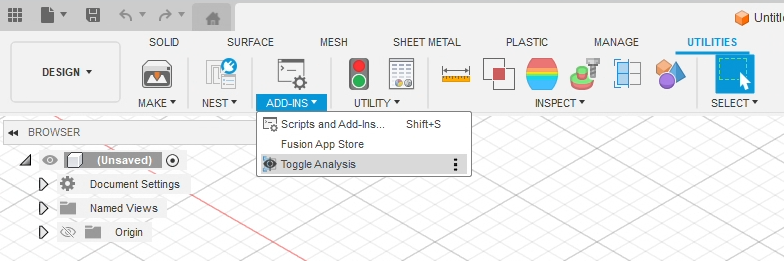
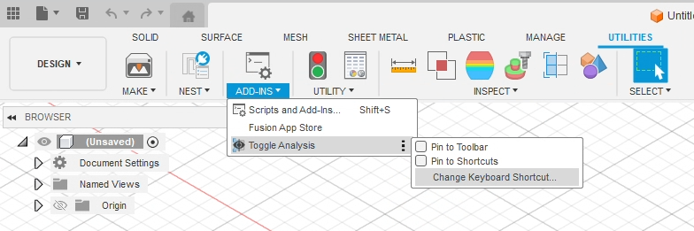

# fusion360-toggleanalysis-addin
   A vibe coded Autodesk Fusion 360 Add-In which toggles the visibility of the Analysis folder in the browser so that you can add that functionality to a keyboard shortcut. Useful for toggling your section view quickly.

   

   ## Overview
   Adds a button to the UTILITIES > ADD-INS panel which toggles the visibility of the Analysis Folder. The button is less than useful in itself, but it adds the ability for you to bind it to a keyboard shortcut (such as `ctrl+shift+a`)

   

   ## Installation

   1. Copy the `ToggleAnalysis` folder into your Fusion 360 add-ins directory:
      - **Windows**: `%appdata%\Autodesk\Autodesk Fusion 360\API\AddIns\`
      - **Mac**: `~/Library/Application Support/Autodesk/Autodesk Fusion 360/API/AddIns/`
   2. In Fusion, go to **Utilities > Scripts and Add-Ins**
   3. Find "ToggleAnalysis" and click **"Run"**
   4. (optional) in Utilities > Scripts and Add-Ins mark the add in to **Run On Startup**

   ## Usage
   1. Click button / enter chosen keyboard shortcut
   2. See your analysis folder toggle between visible and not visible

   ### Adding A Keyboard Shortcut
   

1. Find the newly added button in **UTILITIES > ADD-INS**
2. Hover over it, and click the three dots which appear on the right side of the button
3. Click "Change Keyboard Shortcut..."
4. In the dialog window which pops up, enter your chosen keybinding
    - Personally, I opted for `ctrl+shift+a`
